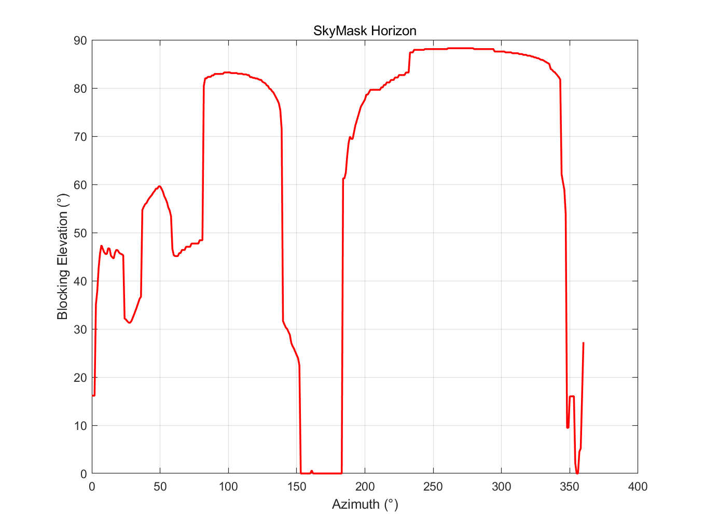
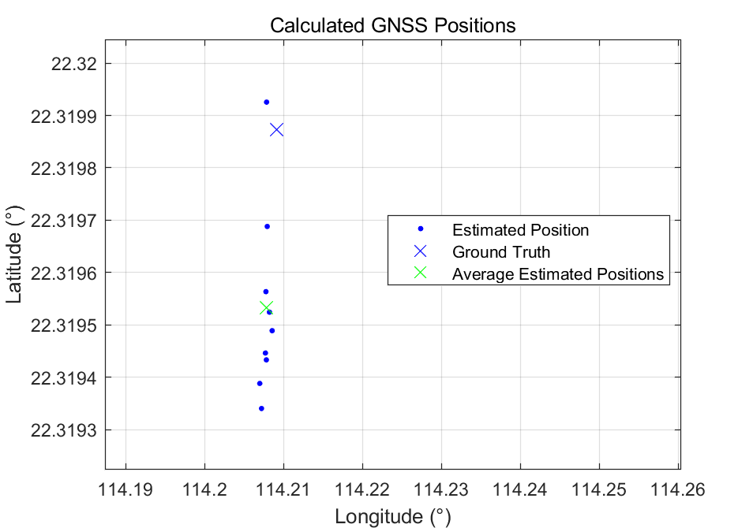
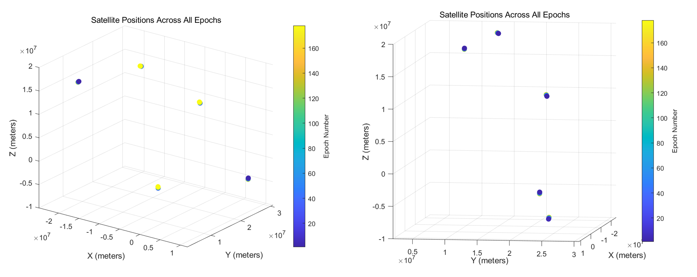

# Assignment2

# Task 1 – Differential GNSS Positioning

### Evaluating Advanced GNSS Techniques for Smartphone Navigation

The ubiquity of smartphones equipped with GNSS receivers has redefined location-based services and navigation. Yet, the standard GNSS positioning accuracy—typically ranging between 3 to 10 meters—is insufficient for high-precision applications such as lane-level vehicle guidance, augmented reality, and autonomous navigation. To meet growing demands for sub-meter accuracy on mobile platforms, several enhanced GNSS techniques have been developed, including Differential GNSS (DGNSS), Real-Time Kinematic (RTK), Precise Point Positioning (PPP), and the hybrid method known as PPP-RTK. These techniques vary in terms of their reliance on external infrastructure, convergence speed, achievable accuracy, and suitability for smartphone integration.

**Differential GNSS (DGNSS)** improves positional accuracy by referencing known fixed ground stations. These stations compute corrections for atmospheric delays and satellite clock or orbital errors, which are then transmitted to nearby GNSS receivers. Widely available Satellite-Based Augmentation Systems (SBAS)—such as WAAS in North America or EGNOS in Europe—provide regional correction services that can enhance accuracy to 1–2 meters on compatible smartphones. DGNSS is particularly effective in open-sky environments and can be implemented with relatively low computational overhead. However, DGNSS performance degrades with increasing distance from the reference station and is limited by its susceptibility to urban multipath errors. Moreover, the lack of support for fine-grained carrier-phase correction means DGNSS cannot satisfy applications requiring sub-meter or centimeter-level positioning.

**Real-Time Kinematic (RTK)** offers a compelling alternative for applications demanding centimeter-level precision. It works by resolving carrier-phase ambiguities from GNSS signals using continuous, low-latency corrections streamed from a nearby ground base station. Under optimal conditions, RTK can achieve horizontal accuracies as fine as 1–10 centimeters. However, this potential is hampered by several practical limitations. RTK requires a dual-frequency GNSS chipset and a reliable data connection to a base station typically within 10–20 kilometers. In smartphone use cases, such conditions are rarely guaranteed, especially in urban environments where buildings cause signal blockages and cycle slips. These disruptions necessitate costly re-initializations, undermining RTK’s robustness in dynamic or obstructed environments. Additionally, RTK imposes high computational and power demands, which challenge the energy and processing constraints of consumer-grade mobile devices.

**Precise Point Positioning (PPP)** offers a more globally scalable approach by utilizing precise satellite orbit and clock corrections, usually delivered via global networks over the internet. Unlike RTK, PPP does not require proximity to ground reference stations and can achieve decimeter-level positioning accuracy across the globe. This makes it particularly useful in remote or infrastructure-poor regions. However, PPP’s primary limitation lies in its slow convergence time, which can range from 15 to over 45 minutes depending on satellite geometry and data continuity. For real-time navigation scenarios, this delay renders PPP largely impractical. Furthermore, like RTK, PPP depends on dual-frequency GNSS signals and raw measurement access, imposing substantial computational overhead and posing a barrier to seamless smartphone integration.

To address the limitations of **both RTK and PPP**, PPP-RTK emerges as a hybrid solution that combines global correction capabilities with rapid convergence and centimeter-level precision. This method leverages a distributed network of reference stations, often delivering corrections in the State Space Representation (SSR) format. By modeling atmospheric delays and satellite errors spatially, PPP-RTK can reduce convergence times to between 30 seconds and 5 minutes—significantly faster than PPP—while maintaining similar levels of accuracy (2–20 cm). Unlike RTK, PPP-RTK is less reliant on line-of-sight to a local base station and is thus more robust in urban environments. Nevertheless, it still demands dual-frequency hardware, persistent internet connectivity, and often access to subscription-based services. These requirements, along with high power consumption and processing complexity, currently restrict PPP-RTK’s widespread adoption in mobile applications, though it remains the most promising candidate for future high-accuracy GNSS in smartphones.

---

## Quantitative Comparison

The following table summarizes the key differences among the four techniques and baseline GNSS:


| Feature                  | DGNSS (SBAS/Local) | RTK (Real-Time Kinematic) | PPP (Precise Point Positioning) | PPP-RTK (Network/SSR) | Standalone GNSS |
|--------------------------|-------------------|----------------------------|----------------------------------|------------------------|------------------|
| Accuracy (Horizontal)    | 0.5 – 2 m         | 0.01 – 0.1 m               | 0.05 – 0.3 m                     | 0.02 – 0.2 m           | 3 – 10+ m        |
| Accuracy (Vertical)      | 1 – 5 m           | 0.02 – 0.2 m               | 0.1 – 0.6 m                      | 0.05 – 0.4 m           | 5 – 20+ m        |
| Convergence Time         | < 10 sec          | 10s – 2 min                | 15 – 45+ min                     | 30s – 5 min            | < 30 sec         |
| Urban Reliability        | Moderate          | Very Low                   | Low (pre), Moderate (post)       | Moderate to High       | Low–Moderate     |
| Infrastructure Required  | SBAS/Base         | Local Base (<20 km)        | Global Correction Service        | Network + SSR Provider | None             |
| Hardware Chipset         | Single Freq OK    | Dual Freq Essential        | Dual Freq Recommended            | Dual Freq Essential    | Single Freq OK   |
| Processing Load          | Low               | Very High                  | High                             | High to Very High      | Low              |
| Data Link Required       | SBAS: No / Local: Yes | Yes                     | Yes                              | Yes                    | No               |
| Service Cost             | Free              | –                          | –                                | –                      | Free             |
| Power Consumption        | Low               | High                       | High                             | High                   | Low              |

---

Key performance metrics clearly distinguish these techniques. RTK achieves the highest accuracy under ideal conditions, but suffers severely in urban environments due to signal obstructions. PPP-RTK and PPP both deliver wide-area support and high accuracy, but at the cost of convergence delays and processing demand. DGNSS offers a low-cost, near-instant improvement over standalone GNSS (with <10s convergence) but falls short in meeting precision-critical requirements. Importantly, all advanced techniques—except SBAS-based DGNSS—require dual-frequency chipsets and access to correction services, which are not yet standard in consumer-grade smartphones. Among them, PPP-RTK demonstrates the best compromise, offering fast convergence, high precision, and wide-area availability, though its computational and subscription requirements remain limiting factors.

From a user experience standpoint, DGNSS provides the most seamless integration, especially via SBAS. In contrast, RTK, PPP, and PPP-RTK introduce varying degrees of complexity in setup, signal processing, and service access. Their reliance on continuous data connectivity and high-frequency measurement streams also leads to increased battery consumption—a critical factor for smartphone design. However, technological advances offer hope: the proliferation of multi-frequency GNSS chips, enhanced on-device computing, and wider availability of correction networks (e.g., Galileo HAS, BeiDou PPP-B2b) could reduce infrastructure dependence and lower the barrier for adoption. Additionally, improvements in sensor fusion—combining GNSS with IMUs, visual odometry, and other sensors—may help mitigate signal loss and improve accuracy and reliability in constrained environments.

In conclusion, standard GNSS remains sufficient for casual navigation but fails to satisfy the precision and robustness demanded by emerging mobile applications. DGNSS represents a modest enhancement that is already widely deployed, while RTK, despite its theoretical accuracy, is hindered by high infrastructure and environment sensitivity. PPP offers global potential but is impractical for time-sensitive use. Among all, PPP-RTK stands out as the most viable solution for next-generation smartphones, balancing coverage, convergence, and precision. Its success, however, hinges on continued progress in chipset capabilities, cloud-based correction services, and energy-efficient computation.

*Word count: ~1010*


# Task 2 – GNSS in Urban Areas

This task implements a GNSS positioning algorithm using a **Weighted Least Squares (WLS)** method. It incorporates a **SkyMask** to filter out obstructed satellites based on urban blockage and applies an **elevation-based weighting function** to reduce the impact of low-angle signals typically affected by multipath.

---

## Implementation Details

### Data Loading

- Satellite measurements including pseudorange, azimuth, elevation, and ECEF satellite positions are loaded from `navSolutions_urban.mat`.
- SkyMask horizon data is read from `SkyMask_A1_urban.csv`, defining the blocking elevation angle for each azimuth (0–360°).

### SkyMask Processing

- The SkyMask data is interpolated into a 1-degree resolution vector to determine the **blocking elevation** for every azimuth direction.
- An offset `delta = 25°` is subtracted from the SkyMask to form a **relative elevation mask** (`SkyMaskRel`), allowing only satellites above this threshold to be considered visible.
- The original SkyMask horizon is plotted as follows:

**Figure 1**: SkyMask Horizon  
*Blocking elevation as a function of azimuth.*



---

## Satellite Visibility and Weighting

- For each epoch:
  - A satellite is **considered visible** if its elevation exceeds the `SkyMaskRel` value for its corresponding azimuth.
  - A **weight** is assigned to each visible satellite based on its elevation and its margin above the mask:
  
    ```matlab
    w_i = sin(deg2rad(elevation_i - el_block)) * sin(deg2rad(elevation_i));
    ```

- If fewer than four satellites are visible in an epoch, the epoch is skipped.

---

## Weighted Least Squares (WLS) Positioning

- When at least four satellites are visible, a **Gauss–Newton iteration** is used to estimate receiver state:

### Iterative WLS Steps:

1. **Initialize** the receiver state vector using ground truth position (converted to ECEF) and clock bias \( dt_0 = 0 \).
2. For each iteration:
   - Calculate predicted pseudoranges.
   - Form residuals \( r_i = \rho_{\text{measured},i} - \rho_{\text{predicted},i} \).
   - Construct the **design matrix** \( H \), containing partial derivatives w.r.t. position and clock bias.
   - Apply the WLS update:

     ```matlab
     dx = (H' * W * H)^(-1) * H' * W * r
     x_est = x_est + dx
     ```

   - Check convergence using \( \|dx\| < 10^{-4} \).

- The solution is stored for each valid epoch. If no epochs have enough satellites, the mask is **relaxed by 2°** and re-evaluated.

---

## Results Analysis

- Final estimated positions are plotted and compared with the **ground truth**.

**Figure 2**: Estimated GNSS Positions  
*Estimated positions (blue), ground truth (cross), and average estimated position (green).*




### Observations:

- **Position Scatter**: Estimates form a visible cluster with some spread, likely due to suboptimal satellite geometry and signal obstruction.
- **Bias**: A consistent offset exists between the estimated cluster and ground truth, indicating a **systematic measurement bias**.
- **Average Position**: The green 'X' shows the average of the first 9 valid estimates, giving a quantitative summary of the bias.
- **Satellite Visibility**: Initial SkyMask (with `delta = 25`) resulted in <4 visible satellites in many epochs. Relaxation by 2° recovered visibility and allowed position computation.

---

## Conclusion

This exercise demonstrates the challenges of urban GNSS and the benefit of SkyMask filtering and elevation-based weighting. Despite these measures, urban geometry and signal blockage still degrade accuracy and limit solution availability. Future improvements may include:

- Multi-constellation GNSS (e.g., BeiDou, Galileo)
- Sensor fusion (IMU, barometer, visual odometry)
- Real-time SkyMask updating based on 3D maps or LiDAR

These enhancements could help further mitigate urban positioning errors and enable robust performance in obstructed environments.


# Task 3 – GPS RAIM (Receiver Autonomous Integrity Monitoring)

This task investigates the challenges of GNSS positioning in urban environments. Urban areas introduce several difficulties, including:

- **Signal Blockage**: Tall buildings and structures can obstruct the direct line-of-sight between GNSS satellites and the receiver.
- **Multipath Effects**: Signals may reflect off surfaces such as walls and windows, leading to delayed and distorted signals that interfere with the direct signal, affecting measurement accuracy.
- **Limited Satellite Visibility**: The restricted view of the sky reduces the number and spatial diversity of visible satellites, resulting in weak geometric conditions (high GDOP – Geometric Dilution of Precision).

The goal is to enhance GNSS positioning performance using the provided *Urban* dataset (`navSolutions_opensky.mat`). This dataset includes a skymask that simulates urban canyon effects by defining satellite visibility constraints for different azimuth and elevation angles.

The ground truth position is:

- **Latitude**: 22.3198722°
- **Longitude**: 114.2091017777778°
- **Altitude**: 3.0 meters

---

## Methodology and Principles

### Data Loading

- Pseudorange and satellite position data are loaded from the file `navSolutions_opensky.mat`.

### Weighted Least Squares (WLS) Estimation (Simplified)

- GNSS positioning relies on solving an overdetermined system of equations derived from pseudorange measurements. For satellite *i*, the basic equation is:

  ```
  rho_i = sqrt((x_sat_i - x_user)^2 + (y_sat_i - y_user)^2 + (z_sat_i - z_user)^2) + c * dt_user + error_i
  ```

- This nonlinear equation is linearized around an approximate user position, resulting in the system:

  ```
  delta_rho = A * delta_x
  ```

- The simplified, non-iterative implementation computes matrix `A(i,:) = [u_x_i, u_y_i, u_z_i, -1]`, where `(u_x_i, u_y_i, u_z_i)` is the unit vector from the receiver (origin) to the satellite.

- A weight matrix `W` is used. For unweighted least squares, `W = eye(n)` (identity matrix).

- The position vector `position = [x, y, z, clock_offset_term]` is estimated using:

  ```
  position = (A' * W * A)^(-1) * (A' * W * current_pseudoranges)
  ```

### Fault Detection

- RAIM techniques verify the internal consistency of the GNSS measurements.
- Residuals are calculated as:

  ```
  residuals = current_pseudoranges - A * position
  ```

- The test statistic is calculated using:

  ```
  chi_square = (residuals' * W * residuals) / sigma_r2
  sigma_r2 = (residuals' * residuals) / (n - 4)
  ```

  where `n` is the number of satellites, and `4` is the number of estimated parameters (x, y, z, clock).

- This statistic is compared with a critical value from the chi-square distribution:

  ```
  chi2inv(0.99, n - 4)
  ```

- If `chi_square > critical_value`, it indicates a measurement inconsistency or potential fault due to multipath or other urban errors.

### Protection Level (PL) Calculation (Simplified)

- The Protection Level defines a bound on the positioning error that can be guaranteed with high confidence (low integrity risk).
- The simplified formula used:

  ```
  PL = k * sigma
  ```

---

## Results and Discussion



### Satellite Geometry Visualization

The following figures visualize the spatial distribution of the GNSS satellites over the entire observation period. This distribution is a key input for evaluating satellite geometry and positioning performance:

- The 3D positions and epochs show how satellites move relative to the receiver.
- The geometry and number of satellites available at each time step influence the potential positioning quality.
- These plots provide a baseline reference for assessing positioning performance prior to applying urban-specific models like skymasks or fault detection.


# Task 4 – LEO Satellites for Navigation

## Evaluating the Potential of LEO Satellites for Navigation: Augmentation, Not Replacement

Traditional Global Navigation Satellite Systems (GNSS) such as GPS, Galileo, GLONASS, and BeiDou operate from Medium Earth Orbit (MEO), roughly 20,000 km above the Earth. These systems form the core of global Positioning, Navigation, and Timing (PNT) services. The advent of massive Low Earth Orbit (LEO) satellite constellations — including Starlink, OneWeb, and others orbiting between 500–2,000 km — has sparked interest in their potential to augment PNT solutions.

A meaningful evaluation of LEO for navigation must compare its characteristics with MEO systems, focusing on signal dynamics, system design, user equipment, and infrastructure requirements.

### Key Differences Between LEO and MEO Systems

- **LEO satellites travel significantly faster** (~7–8 km/s vs. ~4 km/s for MEO), resulting in:
  - Rapid Doppler shifts.
  - Higher signal strength (~25–35 dB higher at ground level).
  - Shorter visibility periods (minutes vs. hours).
  - High Doppler rate and fast handover demands.

- **Faster motion** also imposes greater strain on receiver algorithms, disrupting phase tracking continuity and posing challenges for high-precision techniques such as RTK or PPP. MEO satellites, by contrast, offer more stable and predictable orbits.

- **Massive LEO constellations** (hundreds to thousands of satellites) could dramatically improve satellite geometry (DOP), provided orbital and timing challenges can be managed effectively.

- **Achieving precise orbit and timing determination (POD)** at scale for fast-moving LEO satellites is vastly more complex than for MEO, requiring frequent ephemeris updates and extensive ground support.

### Challenges in Error Mitigation and Receiver Compatibility

- LEO signals interact differently with the ionosphere. Partial or variable ionospheric transits make modeling delays more difficult.
- Traditional dual-frequency methods for ionospheric correction may not suffice.
- Stronger signals from LEO could increase susceptibility to multipath interference, requiring robust mitigation algorithms.

### Equipment and Infrastructure Limitations

- **Current GNSS receivers are not compatible** with LEO signals. They are designed for MEO frequency bands and relatively slower Doppler dynamics.
- Supporting LEO PNT would require:
  - New RF front-ends and baseband processors.
  - Advanced tracking algorithms.
  - Standardization across providers for interoperability.

### Future Opportunities

Despite these difficulties, technological progress may enable LEO navigation capabilities:
- Miniaturized atomic clocks.
- Inter-satellite links for distributed timing.
- Hybrid positioning algorithms incorporating IMU and visual odometry.

### Final Perspective

LEO satellites offer promising signal strength and geometric diversity, particularly in signal-degraded environments like urban canyons. However, due to challenges in POD, timing accuracy, signal modeling, and hardware compatibility, **LEO is better suited as an augmentation to MEO** rather than a full replacement in the near term.

---

## Comparison Table: MEO GNSS vs. LEO PNT Potential

| **Feature**                 | **MEO GNSS (e.g., GPS, Galileo)** | **LEO PNT (Potential/Concept)**            | **Key Implications for Navigation**                                                                 |
|-----------------------------|-----------------------------------|--------------------------------------------|------------------------------------------------------------------------------------------------------|
| Altitude                   | ~20,000 km                        | ~500 – 2,000 km                             | LEO: Stronger signal, faster movement, shorter visibility.                                          |
| Orbital Period             | ~12 hours                         | ~90 – 120 minutes                           | LEO: Rapidly changing geometry, frequent handovers.                                                 |
| Relative Velocity          | ~4 km/s                           | ~7–8 km/s                                   | LEO: Very high Doppler & Doppler rate, challenging tracking.                                        |
| Constellation Size         | Tens (e.g., 24–32 per system)     | Hundreds to Thousands                       | LEO: Potentially better geometry but huge system complexity.                                        |
| Signal Strength (Ground)   | Relatively Weak                   | Significantly Stronger (~25–35 dB+)         | LEO: Better penetration in canyons but potential for interference/multipath.                        |
| Visibility Duration        | Hours                             | Minutes                                     | LEO: Frequent handovers required, challenges phase continuity.                                      |
| Geometry Change            | Slow / Moderate                   | Very Rapid                                  | LEO: Potentially faster convergence but needs constant updates.                                     |
| POD & Timing Difficulty    | High (established methods)        | Extremely High (scale, dynamics)            | LEO: Major hurdle for achieving high accuracy PNT.                                                  |
| Ionospheric Effect Models  | Full transit, established models  | Partial/Variable transit, complex models    | LEO: Different, potentially harder error modeling required.                                         |
| Receiver Complexity        | Standard GNSS receivers           | Requires new HW/SW for high dynamics        | LEO: Incompatible with current receivers, higher cost/power.                                       |
| Infrastructure Scale       | Significant (Global Ground Network) | Massive (Dense Ground Network, ISLs?)   | LEO: Extremely high deployment and operational cost.                                                |
| Primary Design Goal        | PNT                               | Often Communication (PNT secondary/potential) | MEO: Signals optimized for PNT. LEO: May use signals of opportunity.                            |
| Near-Term Role             | Primary PNT provider              | Augmentation / Niche Applications           | LEO likely to supplement MEO, not replace it soon.                                                  |

---


# Task 5 – GNSS Remote Sensing

## The Transformative Impact of GNSS on Modern Seismology

The use of Global Navigation Satellite Systems (GNSS) in seismology has transformed our understanding of earthquake mechanics and tectonic processes. Traditionally, the study of seismic phenomena relied heavily on ground-based seismometers that measure ground shaking during seismic events. While effective, these instruments are limited in their ability to capture slow or permanent deformations of the Earth's crust. The rise of satellite-based geodesy and the integration of GNSS technology has given birth to **GNSS seismology**, a field that delivers high-precision, continuous, and three-dimensional monitoring of ground displacements over a wide range of spatial and temporal scales.

GNSS seismology enables researchers to:
- Monitor tectonic plate motion at millimeter-level accuracy over long periods.
- Track interseismic strain accumulation, identifying stress build-up along fault lines.
- Observe co-seismic displacements that occur instantaneously during earthquakes.
- Capture post-seismic deformation caused by afterslip or viscoelastic relaxation.
- Contribute to long-term probabilistic seismic hazard mapping using direct geodetic evidence.

By leveraging satellite constellations such as GPS, Galileo, GLONASS, and BeiDou, GNSS stations distributed across tectonically active regions provide real-time data that translates subtle crustal motions into actionable geophysical insights. These capabilities are not only valuable for academic research but have direct implications for public safety and disaster preparedness.

### Real-Time Earthquake Monitoring

When an earthquake strikes, GNSS seismology rapidly transitions from tracking slow strain accumulation to capturing the sudden, permanent displacements that accompany fault rupture. High-rate GNSS stations, capable of recording at 1 Hz or greater, can track co-seismic displacements within seconds of the event. These measurements provide the true static offset of the ground, which is critical for determining the earthquake’s magnitude and slip distribution. Unlike traditional seismometers, which often clip or saturate during large-magnitude earthquakes (M > 7), GNSS provides a linear, non-saturating signal that enhances both the accuracy and reliability of magnitude estimation.

This real-time capability allows:
- Immediate rupture characterization and damage estimation.
- Enhanced input for Earthquake Early Warning (EEW) systems.
- Rapid emergency response and resource allocation decisions.

### GNSS in Early Warning and Hazard Mitigation

GNSS seismology has become an essential component of modern EEW systems. When integrated into seismic monitoring frameworks, GNSS enables near-instantaneous displacement detection, which is critical for issuing timely alerts. This is especially vital for densely populated regions, coastal zones at risk of tsunamis, and critical infrastructure.

For example:
- Japan’s GEONET and California’s ShakeAlert system now incorporate GNSS data to improve alert accuracy and lead time.
- GNSS data has been successfully used to detect tsunami-generating vertical ground motion near subduction zones.
- In areas where underwater seismometers are not feasible, GNSS-based detection of seafloor movement offers an alternative approach.

GNSS can also support damage forecasts by rapidly determining ground deformation patterns, aiding post-event recovery and planning.

### Integration with Other Observation Techniques

The effectiveness of GNSS seismology is magnified when combined with other geophysical tools. Traditional seismometers are adept at capturing high-frequency ground motion, while GNSS excels at identifying long-period displacements and permanent offsets. Together, they provide a “broadband” record of earthquake activity, covering the full spectrum of ground motion.

Additionally, integrating GNSS with Interferometric Synthetic Aperture Radar (InSAR) enables:
- High-resolution deformation mapping between satellite passes.
- Sophisticated modeling of fault slip distributions.
- Improved understanding of rupture dynamics and stress transfer.

This synergy leads to more accurate seismic source models, better forecasts of seismic hazard, and deeper insights into crustal mechanics.

### Limitations and Challenges

Despite its transformative benefits, GNSS seismology is not without limitations. Its sensitivity to small-magnitude or high-frequency events is generally lower than that of traditional seismometers. As a result:
- GNSS is less effective for detecting microseismicity or early precursors of large earthquakes.
- No consistent, reliable precursory deformation signal has been universally observed using GNSS, limiting its predictive power.
- Atmospheric effects (e.g., ionospheric delays), multipath interference, and antenna instability must be corrected through complex processing techniques.

Establishing and maintaining a dense GNSS network is also a significant logistical and financial challenge, especially in remote or offshore areas where ground-based installations are difficult.

### Conclusion

**GNSS seismology** marks a paradigm shift in earthquake science. By enabling the direct measurement of both slow tectonic processes and sudden seismic events, GNSS technology offers unmatched precision and continuity. Its real-time capabilities enhance early warning systems, improve emergency response, and contribute to long-term seismic risk mitigation. While it does not replace traditional seismic instruments, GNSS complements them by filling critical observational gaps and refining our understanding of Earth’s dynamics.

The future of GNSS seismology lies in continued technological integration, denser station deployment, and the development of advanced data fusion algorithms. As GNSS technology continues to evolve, its role in safeguarding lives and infrastructure from seismic hazards will only become more indispensable.

---

**Word Count:** ~990 words


## AI Prompts used

### Task 1:
```
Model: ChatGPT 4o
Prompt 1: How are DGNSS, RTK, PPP, and PPP-RTK used in navigation? How do they differ from traditional GNSS positioning technologies?
Prompt 2: Why does DGNSS positioning accuracy degrade with increasing distance from the base station?
Prompt 3: Why does PPP-RTK enable fast convergence?
Comment: This model is free to use and generally provides accurate, concise explanations that support critical thinking and help clarify technical concepts.
```

### Task 4:
```
Model: ChatGPT 4o
Prompt 1: What are the technical advantages and disadvantages of using LEO satellites in GNSS applications?  
Prompt 2: Why is the signal coverage of LEO satellites limited compared to traditional GNSS (MEO) systems?  
Prompt 3: Why are LEO-based navigation systems more susceptible to disruptions caused by solar activity?  
Comment: This model is free to use and provides technically sound insights. It helped me understand key physical and engineering limitations of LEO-based
navigation systems—especially in terms of signal dynamics, atmospheric vulnerability, and reduced coverage area compared to traditional MEO constellations.
```

### Task 5:
```
Model: ChatGPT 4o
Prompt 1: What are the current real-world applications of GNSS Reflectometry (GNSS-R)?
Prompt 2: How is GNSS-R used in agriculture? Why is this technique preferred over others?
Prompt 3: How does GNSS-R help in observing Earth's surface characteristics (e.g., soil moisture, ocean roughness)? Why is GNSS-R a good fit for such studies?
Prompt 4: How can GNSS-R contribute to understanding the Earth's atmosphere? What makes it advantageous for atmospheric research?
Comment: This model is free and generally provides accurate background knowledge. It was especially helpful for exploring the versatility of GNSS-R in environmental
 monitoring, such as soil moisture estimation, ocean condition tracking, and vegetation status, and for highlighting its passive, low-cost, and all-weather
advantages compared to traditional remote sensing systems.
```
